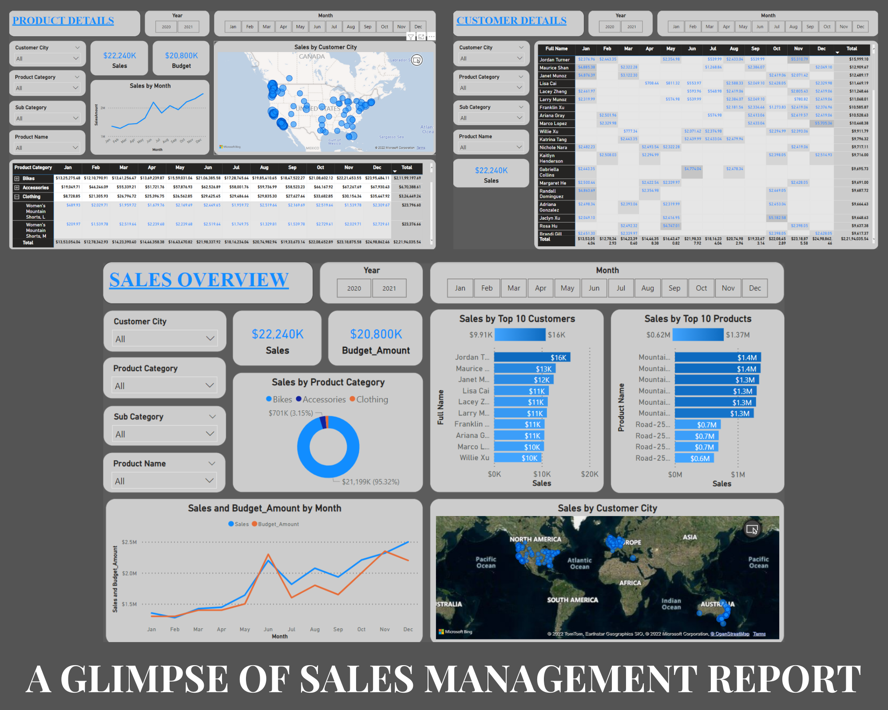
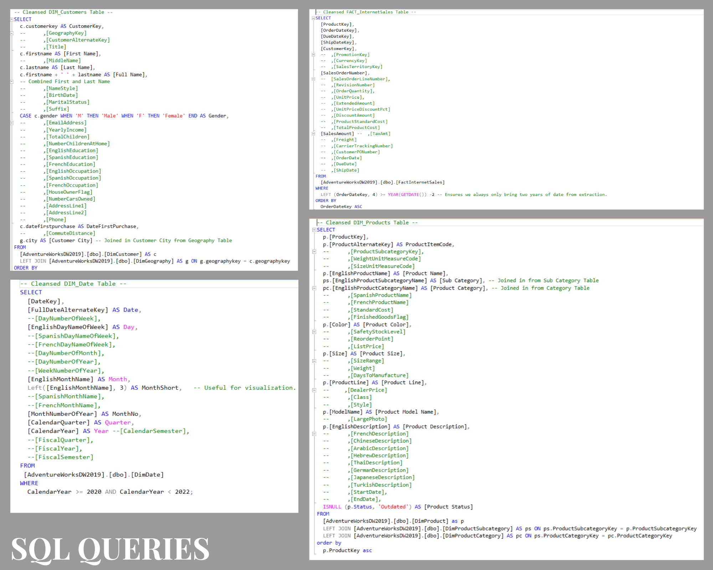
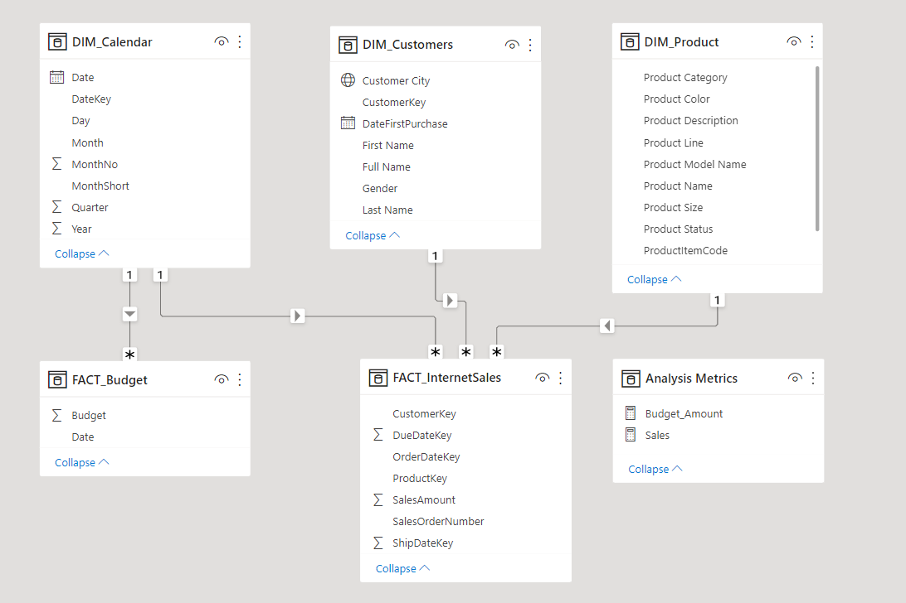
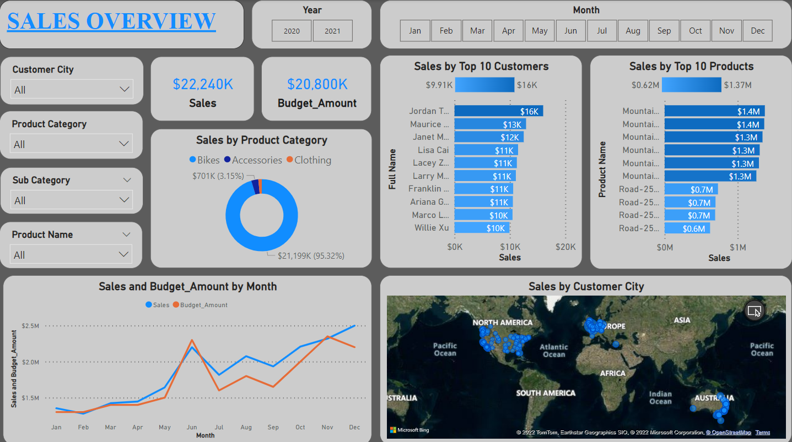
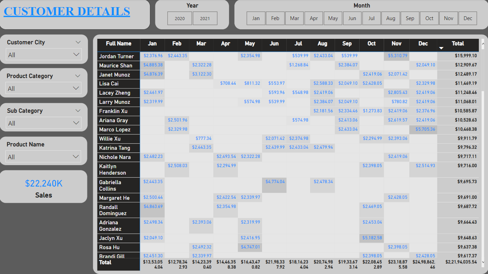
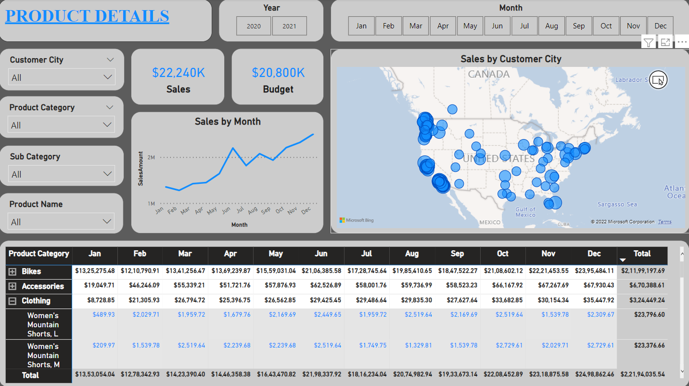

# 📊 Sales Management Project using Power BI and SQL



## 📖 Overview

This project demonstrates how SQL and Power BI can be used together to transform raw sales data into meaningful business insights. The dataset was cleaned and transformed using SQL, modeled in Power BI, and visualized through interactive dashboards that help sales managers and representatives monitor business performance, customer behavior, product sales, and budget tracking.

---

## 🎯 Business Requirements & User Stories

The objective of this project was to develop an executive sales dashboard that enables stakeholders to make informed, data-driven decisions.

| No. | Role | Business Requirement | Business Value | Acceptance Criteria |
| :-- | :--- | :------------------- | :------------- | :------------------ |
| 1 | Sales Manager | View overall sales performance for 2020 and 2021 | Identify top-performing customers and products | Dashboard displays Top 10 Customers and Top 10 Products with interactive filters |
| 2 | Sales Manager | Compare sales with allocated budget | Track sales performance against budget over time | Dashboard includes Sales vs Budget comparison charts |
| 3 | Sales Representative | Analyze sales by customer | Focus on high-value customers and identify growth opportunities | Dashboard supports customer-level filtering |
| 4 | Sales Representative | Analyze sales by product | Monitor product performance | Dashboard supports product-level filtering |

---

# 🛠 Tech Stack

- Microsoft SQL Server
- Power BI Desktop
- Microsoft Excel
- CSV Files

---

# 📂 Project Structure (Template)

```text
Sales-Management-Project-Using-PowerBI-And-SQL/
│
├── Data_for_Power_BI/
│   ├── DIM_Calendar.csv
│   ├── DIM_Customers.csv
│   ├── DIM_Product.csv
│   ├── FACT_InternetSales.csv
│   └── FACT_SentSalesBudget.xlsx
│
├── Images/
│   ├── Overview.png
│   ├── Data_Modelling_Screenshot.png
│   ├── Sales_Overview_Screenshot.png
│   ├── Customer_Details_Screenshot.png
│   ├── Product_Details_Screenshot.png
│   └── SQL_Queries_Collage.png
│
├── SQL_Queries/
│   ├── DIM_Calendar.sql
│   ├── DIM_Customers.sql
│   ├── DIM_Product.sql
│   └── FACT_InternetSales.sql
│
├── Sales_Report_Final.pbix
├── README.md
└── .gitignore
```

---

# 🧹 Data Cleansing & Transformation (SQL)

To build an efficient analytical model, the sales data was cleaned, transformed, and prepared using SQL.

The following SQL scripts were used during the ETL process:

1. [_DIM_Calendar.sql_](SQL_Queries/DIM_Calendar.sql)
2. [_DIM_Customers.sql_](SQL_Queries/DIM_Customers.sql)
3. [_DIM_Product.sql_](SQL_Queries/DIM_Product.sql)
4. [_FACT_InternetSales.sql_](SQL_Queries/FACT_InternetSales.sql)

The sales budget data was provided separately as an Excel file:

- [_FACT_SentSalesBudget.xlsx_](Data_for_Power_BI/FACT_SentSalesBudget.xlsx)

---



---

# 📊 Data Model

After cleaning and transforming the data, all required tables were imported into Power BI to build a star schema data model.

The model establishes relationships between:

- FACT_InternetSales
- FACT_SentSalesBudget
- DIM_Calendar
- DIM_Customers
- DIM_Product

This structure enables efficient reporting and fast analytical queries.



---

# 📈 Sales Management Dashboard

The Power BI report contains three interactive dashboard pages:

### 📌 Sales Overview

Provides a high-level overview of:

- Total Sales
- Sales Trends
- Budget Comparison
- Top Customers
- Top Products



---

### 👥 Customer Analysis

Allows users to:

- Analyze sales by customer
- Identify top customers
- Apply customer-specific filters



---

### 📦 Product Analysis

Allows users to:

- Analyze sales by product
- Identify best-selling products
- Filter by product categories



---

# 📥 Download & Run the Project

## ✅ Option 1 — Clone Using Git

```bash
git clone https://github.com/<your-username>/Sales-Management-Project-using-PowerBI-and-SQL.git
```

Move into the project directory:

```bash
cd Sales-Management-Project-using-PowerBI-and-SQL
```

---

## ✅ Option 2 — Download ZIP

1. Open this repository.
2. Click the **Code** button.
3. Select **Download ZIP**.
4. Extract the downloaded ZIP file.
5. Open the project folder.

---

# ▶ Open the Power BI Report

1. Install **Power BI Desktop**.
2. Open:

```
Sales_Report_Final.pbix
```

3. If prompted, reconnect the data sources.
4. Refresh the dataset to view the latest visualizations.

---

# 📁 Dataset

The project includes:

- Sales Data (CSV)
- Customer Data
- Product Data
- Calendar Data
- Sales Budget (Excel)

These datasets are located inside the **Data_for_Power_BI** folder.

---

# ⭐ Key Features

- SQL Data Cleaning & Transformation
- Star Schema Data Model
- Interactive Power BI Dashboard
- Sales vs Budget Analysis
- Customer Insights
- Product Performance Analysis
- Dynamic Filters & Slicers
- Executive Sales Reporting

---

## 🙌 Acknowledgements

This project was developed for learning and demonstrating Business Intelligence concepts using SQL and Power BI.

If you found this project useful, consider giving it a ⭐ on GitHub.

---


### ⭐ Thank you for visiting this repository!
